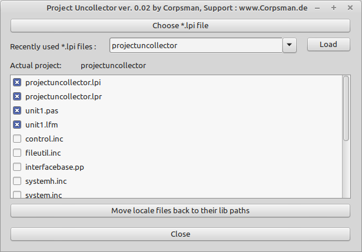

# ProjectUnCollector

I have a Codebase folder structure like this:

<Projects_folder>  
  <Project_1>  
  <Project_2>  
  <Project_3>  
  <Project_4>  
  ..

<Personal_lib_folders>  
 <Lib_1>  
 <Lib_2>  
 <Lib_3>  

If i upload one of my projects to Github or share them with offline friends, they often contribute to my projects. In this case i need to be able to undo the work of the [ProjectCollector](https://github.com/PascalCorpsman/LazarusTools-ProjectCollector) application and move back all my collected files into their origin folders.

With ProjectUnCollector you can do this easy in one step.

Copy the whole project to its destination folder (the place where the .lpi file sits) and run the ProjectUnCollector on it. Now all your lib files are back in their source folders.

Command line support:

-i \<input.lpi file\>
